# 🏗️ Authentication & RBAC Architecture

## System Overview

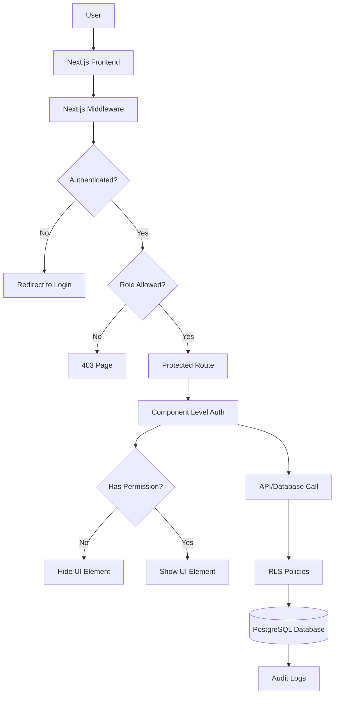
```mermaid
graph TB
    User[User] --> Frontend[Next.js Frontend]
    Frontend --> Middleware[Next.js Middleware]
    Middleware --> AuthCheck{Authenticated?}
    AuthCheck -->|No| Login[Redirect to Login]
    AuthCheck -->|Yes| RoleCheck{Role Allowed?}
    RoleCheck -->|No| Unauthorized[403 Page]
    RoleCheck -->|Yes| ProtectedRoute[Protected Route]
    
    ProtectedRoute --> ComponentAuth[Component Level Auth]
    ComponentAuth --> PermissionCheck{Has Permission?}
    PermissionCheck -->|No| HideUI[Hide UI Element]
    PermissionCheck -->|Yes| ShowUI[Show UI Element]
    
    ComponentAuth --> APICall[API/Database Call]
    APICall --> RLS[RLS Policies]
    RLS --> DB[(PostgreSQL Database)]
    DB --> AuditLog[Audit Logs]
```

---

## Authentication Flow

### Email/Password Flow

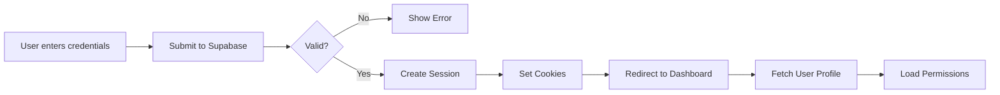
```mermaid
graph LR
    A[User enters credentials] --> B[Submit to Supabase]
    B --> C{Valid?}
    C -->|No| D[Show Error]
    C -->|Yes| E[Create Session]
    E --> F[Set Cookies]
    F --> G[Redirect to Dashboard]
    G --> H[Fetch User Profile]
    H --> I[Load Permissions]
```

### Magic Link Flow

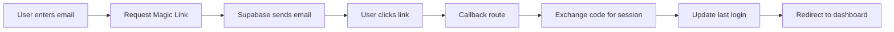
```mermaid
graph LR
    A[User enters email] --> B[Request Magic Link]
    B --> C[Supabase sends email]
    C --> D[User clicks link]
    D --> E[Callback route]
    E --> F[Exchange code for session]
    F --> G[Update last login]
    G --> H[Redirect to dashboard]
```

### OAuth Flow

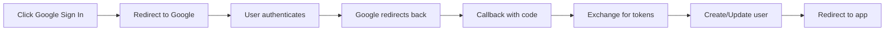
```mermaid
graph LR
    A[Click Google Sign In] --> B[Redirect to Google]
    B --> C[User authenticates]
    C --> D[Google redirects back]
    D --> E[Callback with code]
    E --> F[Exchange for tokens]
    F --> G[Create/Update user]
    G --> H[Redirect to app]
```

---

## Authorization Layers

### Layer 1: Middleware

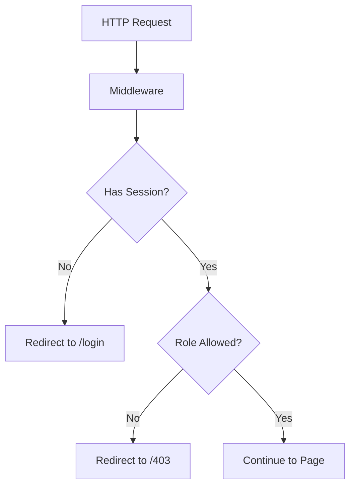
```mermaid
graph TB
    Request[HTTP Request] --> Middleware
    Middleware --> CheckSession{Has Session?}
    CheckSession -->|No| RedirectLogin[Redirect to /login]
    CheckSession -->|Yes| CheckRole{Role Allowed?}
    CheckRole -->|No| Redirect403[Redirect to /403]
    CheckRole -->|Yes| Continue[Continue to Page]
```

### Layer 2: Route Protection

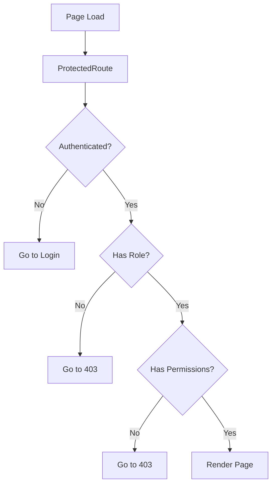
```mermaid
graph TB
    Page[Page Load] --> ProtectedRoute
    ProtectedRoute --> CheckAuth{Authenticated?}
    CheckAuth -->|No| GoLogin[Go to Login]
    CheckAuth -->|Yes| CheckRoles{Has Role?}
    CheckRoles -->|No| Go403[Go to 403]
    CheckRoles -->|Yes| CheckPerms{Has Permissions?}
    CheckPerms -->|No| Go403_2[Go to 403]
    CheckPerms -->|Yes| Render[Render Page]
```

### Layer 3: Component Guards

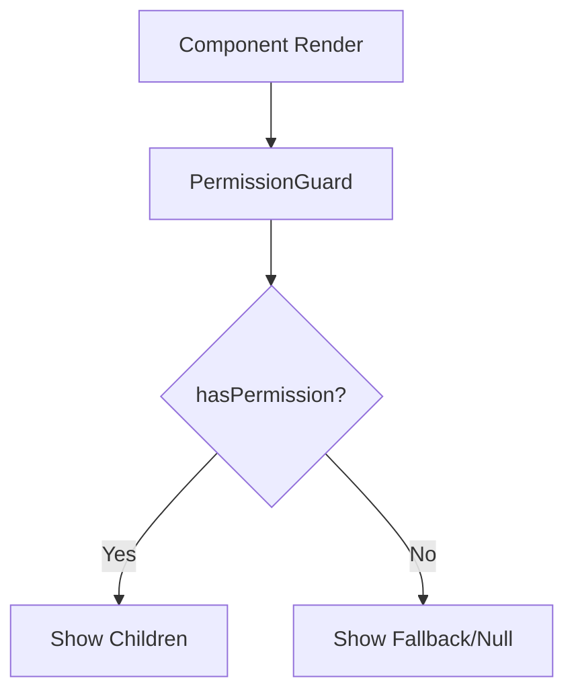
```mermaid
graph TB
    Component[Component Render] --> Guard[PermissionGuard]
    Guard --> Check{hasPermission?}
    Check -->|Yes| Show[Show Children]
    Check -->|No| Fallback[Show Fallback/Null]
```

### Layer 4: Database RLS

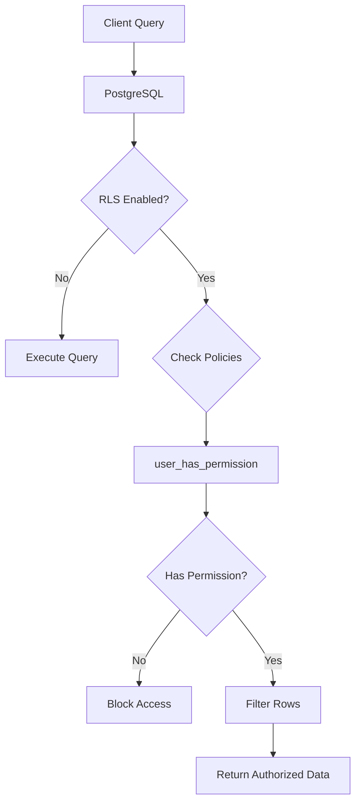
```mermaid
graph TB
    Query[Client Query] --> Postgres[PostgreSQL]
    Postgres --> RLSEnabled{RLS Enabled?}
    RLSEnabled -->|No| Execute[Execute Query]
    RLSEnabled -->|Yes| PolicyCheck{Check Policies}
    PolicyCheck --> FuncCall[user_has_permission]
    FuncCall --> PermCheck{Has Permission?}
    PermCheck -->|No| Block[Block Access]
    PermCheck -->|Yes| Filter[Filter Rows]
    Filter --> Return[Return Authorized Data]
```

---

## Database Schema

### Core Tables

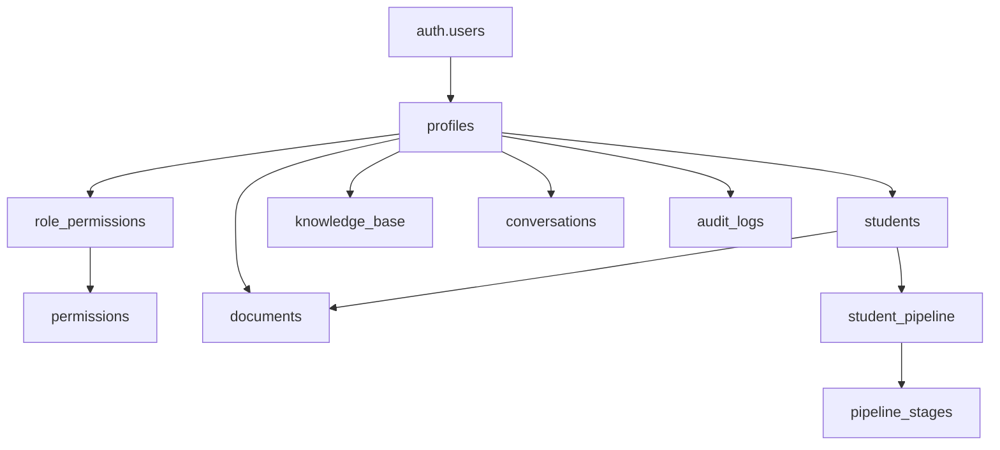
```mermaid
graph TB
    Users[auth.users] --> Profiles[profiles]
    Profiles --> RolePermissions[role_permissions]
    RolePermissions --> Permissions[permissions]
    
    Profiles --> Students[students]
    Profiles --> Documents[documents]
    Profiles --> Knowledge[knowledge_base]
    Profiles --> Conversations[conversations]
    Profiles --> AuditLogs[audit_logs]
    
    Students --> Documents
    Students --> Pipeline[student_pipeline]
    Pipeline --> Stages[pipeline_stages]
```

### Permission Relationships

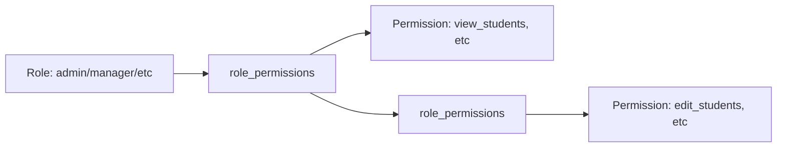
```mermaid
graph LR
    Role[Role: admin/manager/etc] --> RP[role_permissions]
    RP --> Perm[Permission: view_students, etc]
    RP --> RP2[role_permissions]
    RP2 --> Perm2[Permission: edit_students, etc]
```

---

## Permission Checking Flow

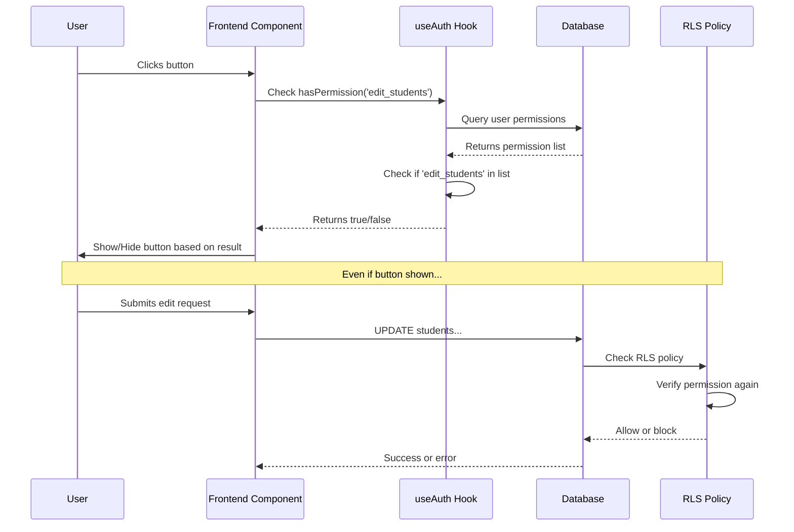
```mermaid
sequenceDiagram
    participant U as User
    participant FC as Frontend Component
    participant Hook as useAuth Hook
    participant DB as Database
    participant RLS as RLS Policy
    
    U->>FC: Clicks button
    FC->>Hook: Check hasPermission('edit_students')
    Hook->>DB: Query user permissions
    DB-->>Hook: Returns permission list
    Hook->>Hook: Check if 'edit_students' in list
    Hook-->>FC: Returns true/false
    FC->>U: Show/Hide button based on result
    
    Note over U,RLS: Even if button shown...
    U->>FC: Submits edit request
    FC->>DB: UPDATE students...
    DB->>RLS: Check RLS policy
    RLS->>RLS: Verify permission again
    RLS-->>DB: Allow or block
    DB-->>FC: Success or error
```

---

## Security Layers

### Defense in Depth

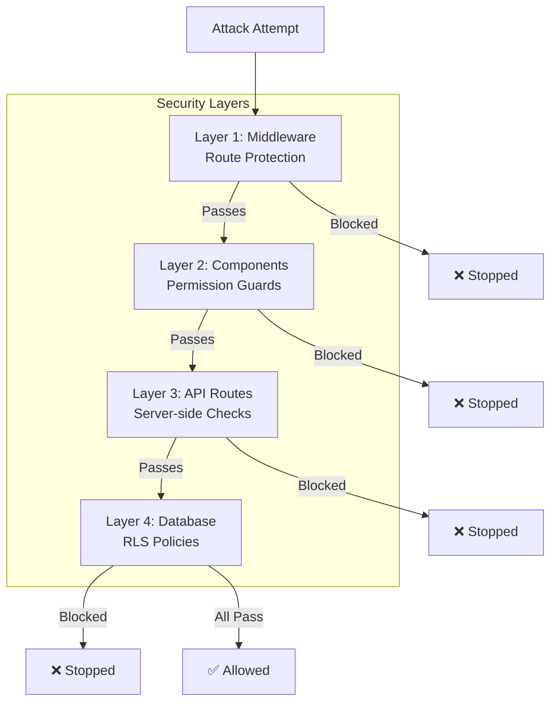
```mermaid
graph TB
    subgraph "Security Layers"
        L1[Layer 1: Middleware<br/>Route Protection]
        L2[Layer 2: Components<br/>Permission Guards]
        L3[Layer 3: API Routes<br/>Server-side Checks]
        L4[Layer 4: Database<br/>RLS Policies]
    end
    
    Attack[Attack Attempt] --> L1
    L1 -->|Blocked| Stop1[❌ Stopped]
    L1 -->|Passes| L2
    L2 -->|Blocked| Stop2[❌ Stopped]
    L2 -->|Passes| L3
    L3 -->|Blocked| Stop3[❌ Stopped]
    L3 -->|Passes| L4
    L4 -->|Blocked| Stop4[❌ Stopped]
    L4 -->|All Pass| Success[✅ Allowed]
```

---

## User Management Flow

### Invite User Process

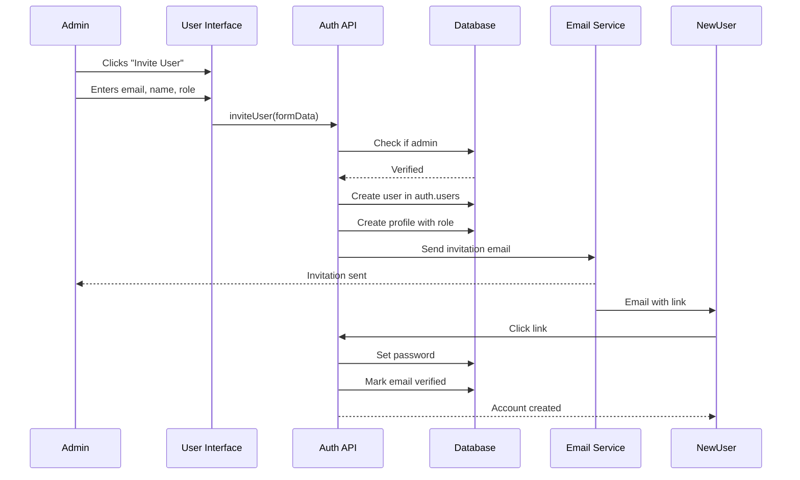
```mermaid
sequenceDiagram
    participant Admin
    participant UI as User Interface
    participant API as Auth API
    participant DB as Database
    participant Email as Email Service
    
    Admin->>UI: Clicks "Invite User"
    Admin->>UI: Enters email, name, role
    UI->>API: inviteUser(formData)
    API->>DB: Check if admin
    DB-->>API: Verified
    API->>DB: Create user in auth.users
    API->>DB: Create profile with role
    API->>Email: Send invitation email
    Email-->>Admin: Invitation sent
    Email->>NewUser: Email with link
    NewUser->>API: Click link
    API->>DB: Set password
    API->>DB: Mark email verified
    API-->>NewUser: Account created
```

---

## Session Management

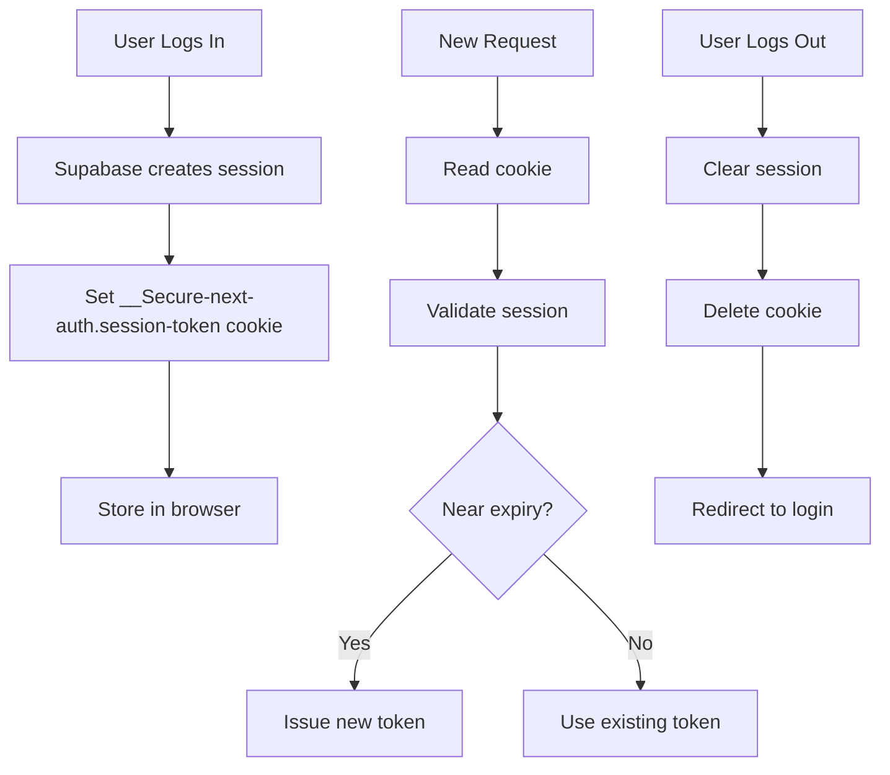
```mermaid
graph TB
    Login[User Logs In] --> CreateSession[Supabase creates session]
    CreateSession --> SetCookie[Set __Secure-next-auth.session-token cookie]
    SetCookie --> Store[Store in browser]
    
    Request[New Request] --> ReadCookie[Read cookie]
    ReadCookie --> Validate[Validate session]
    Validate --> Refresh{Near expiry?}
    Refresh -->|Yes| NewToken[Issue new token]
    Refresh -->|No| UseToken[Use existing token]
    
    Logout[User Logs Out] --> ClearSession[Clear session]
    ClearSession --> DeleteCookie[Delete cookie]
    DeleteCookie --> Redirect[Redirect to login]
```

---

## File Structure

```
src/
├── lib/supabase/
│   ├── auth.ts              # Auth functions (signIn, signOut, invite, etc.)
│   ├── client.ts            # Client-side Supabase instance
│   ├── server.ts            # Server-side Supabase instance
│   └── types.ts             # TypeScript types
│
├── hooks/
│   └── useAuth.ts           # Main auth hook with permissions
│
├── components/
│   └── auth/
│       └── ProtectedRoute.tsx  # Route protection components
│
├── app/
│   ├── (auth)/
│   │   └── login/
│   │       └── page.tsx     # Enhanced login page
│   ├── auth/
│   │   └── callback/
│   │       └── route.ts     # OAuth/Magic Link handler
│   ├── 403-unauthorized/
│   │   └── page.tsx         # Access denied page
│   └── (dashboard)/
│       └── settings/
│           └── users/
│               └── page.tsx # User management (Admin)
│
└── middleware.ts            # Route-level protection
```

---

## State Management

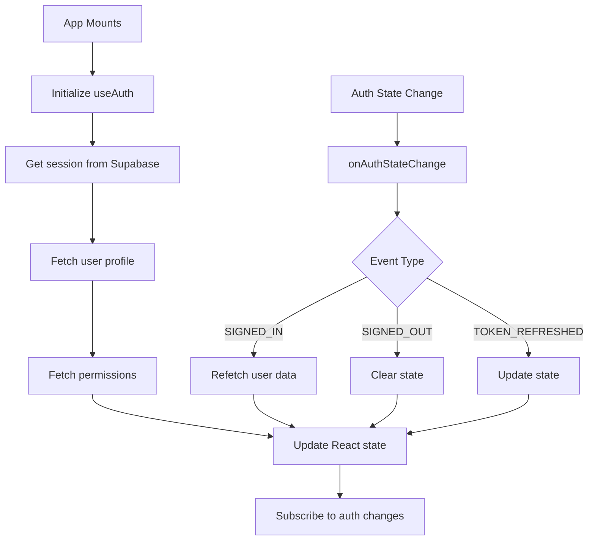
```mermaid
graph TB
    App[App Mounts] --> InitAuth[Initialize useAuth]
    InitAuth --> GetSession[Get session from Supabase]
    GetSession --> FetchProfile[Fetch user profile]
    FetchProfile --> FetchPerms[Fetch permissions]
    FetchPerms --> UpdateState[Update React state]
    UpdateState --> Subscribe[Subscribe to auth changes]
    
    AuthChange[Auth State Change] --> Event[onAuthStateChange]
    Event --> HandleEvent{Event Type}
    HandleEvent -->|SIGNED_IN| Refetch[Refetch user data]
    HandleEvent -->|SIGNED_OUT| Clear[Clear state]
    HandleEvent -->|TOKEN_REFRESHED| Update[Update state]
    
    Refetch --> UpdateState
    Clear --> UpdateState
    Update --> UpdateState
```

---

## Deployment Architecture

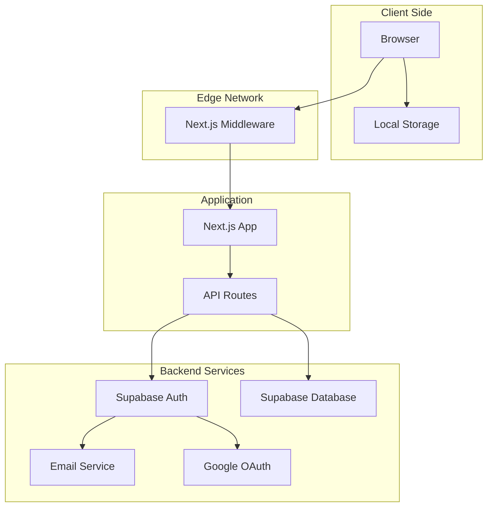
```mermaid
graph TB
    subgraph "Client Side"
        Browser[Browser]
        LocalStorage[Local Storage]
    end
    
    subgraph "Edge Network"
        Middleware[Next.js Middleware]
    end
    
    subgraph "Application"
        NextJS[Next.js App]
        API[API Routes]
    end
    
    subgraph "Backend Services"
        SupabaseAuth[Supabase Auth]
        SupabaseDB[Supabase Database]
        EmailService[Email Service]
        OAuthProvider[Google OAuth]
    end
    
    Browser --> Middleware
    Middleware --> NextJS
    NextJS --> API
    API --> SupabaseAuth
    API --> SupabaseDB
    SupabaseAuth --> EmailService
    SupabaseAuth --> OAuthProvider
    Browser --> LocalStorage
```

---

## Key Design Decisions

### Why Multiple Security Layers?

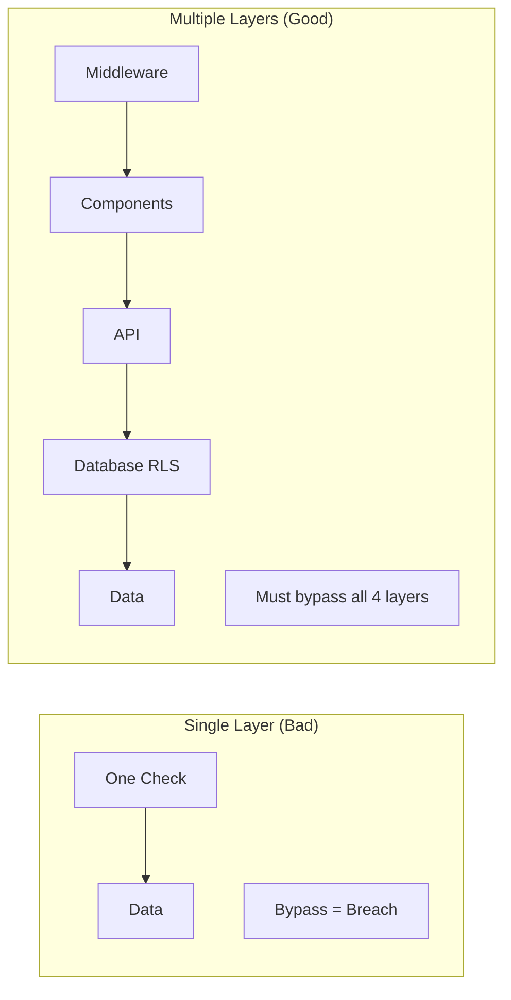
```mermaid
graph LR
    subgraph "Single Layer (Bad)"
        Single[One Check] --> Data[Data]
        Bypass[Bypass = Breach]
    end
    
    subgraph "Multiple Layers (Good)"
        L1[Middleware] --> L2[Components]
        L2 --> L3[API]
        L3 --> L4[Database RLS]
        L4 --> Data2[Data]
        Bypass2[Must bypass all 4 layers]
    end
```

### Why Permission-Based Instead of Just Role-Based?

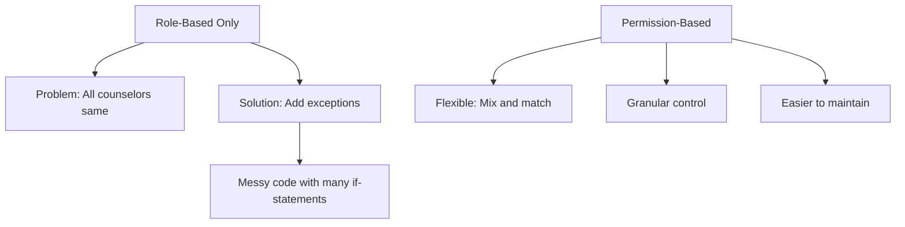
```mermaid
graph TB
    RoleOnly[Role-Based Only] --> Problem[Problem: All counselors same]
    RoleOnly --> Solution1[Solution: Add exceptions]
    Solution1 --> Messy[Messy code with many if-statements]
    
    PermBased[Permission-Based] --> Flexible[Flexible: Mix and match]
    PermBased --> Granular[Granular control]
    PermBased --> Maintainable[Easier to maintain]
```

---

## Performance Considerations

### Permission Caching

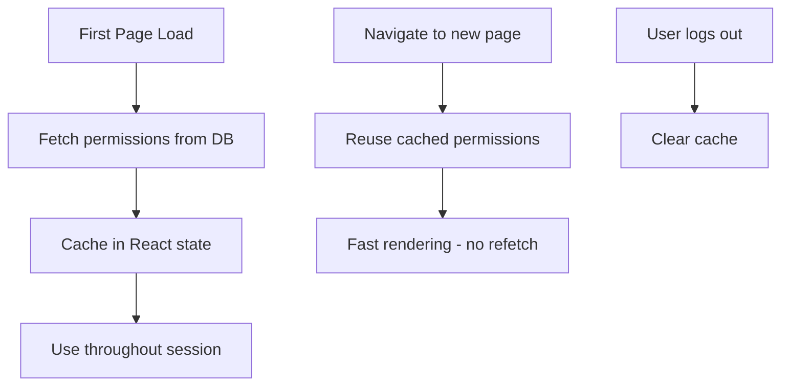
```mermaid
graph TB
    FirstLoad[First Page Load] --> Fetch[Fetch permissions from DB]
    Fetch --> Cache[Cache in React state]
    Cache --> Use[Use throughout session]
    
    Nav[Navigate to new page] --> Reuse[Reuse cached permissions]
    Reuse --> Fast[Fast rendering - no refetch]
    
    Logout[User logs out] --> ClearCache[Clear cache]
```

### RLS Optimization

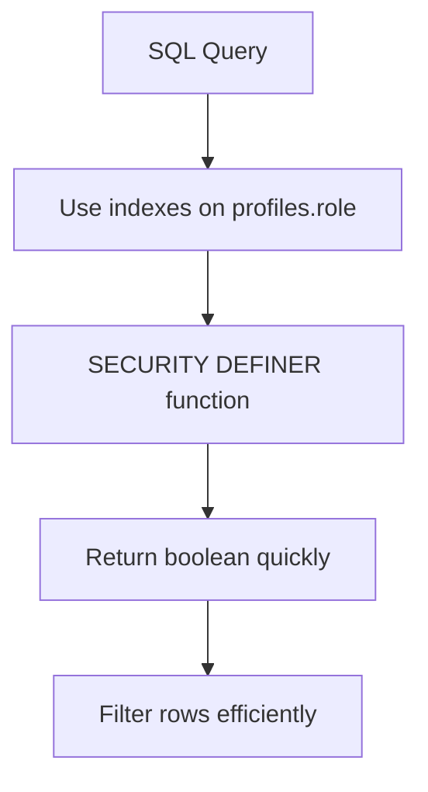
```mermaid
graph TB
    Query[SQL Query] --> Index[Use indexes on profiles.role]
    Index --> Function[SECURITY DEFINER function]
    Function --> Result[Return boolean quickly]
    Result --> Filter[Filter rows efficiently]
```

---

## Monitoring Points

```mermaid
mindmap
  root((Monitoring))
    Authentication
      Failed logins
      Session duration
      Token refreshes
      OAuth failures
    Authorization
      Permission denials
      Route blocks
      RLS violations
      403 errors
    User Management
      Invites sent
      Invites accepted
      Role changes
      Last login times
    Security
      Audit log entries
      Suspicious activity
      Rate limiting
      Brute force attempts
```

---

**This architecture provides enterprise-grade security with excellent developer experience!** 🚀
